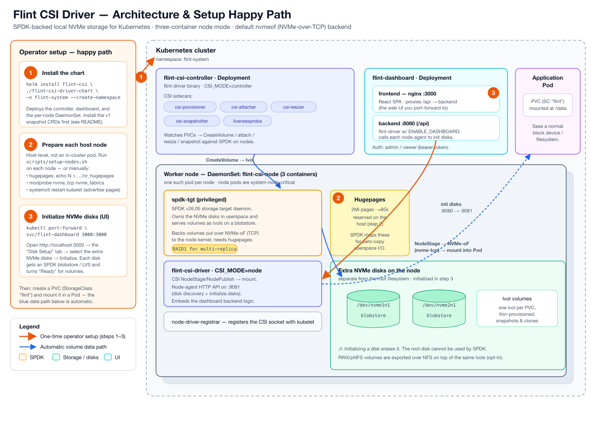

= Flint CSI Driver
:toc:
:toclevels: 2

Kubernetes CSI driver providing high-performance local storage using SPDK (Storage Performance Development Kit) with multi-replica support, snapshots, and volume cloning.

== Prerequisites

=== Hardware Requirements

Each worker node must have:

* **Additional disk(s)** separate from the root filesystem
** These disks will be dedicated to SPDK for volume storage
** NVMe devices recommended for best performance
** Example: `/dev/nvme1n1`, `/dev/sdb`, etc.
* **2GB+ RAM** for hugepages (1024 pages of 2MB each)

⚠️ **IMPORTANT**: The root filesystem disk cannot be used by SPDK. You must have at least one additional disk per node.

=== Software Requirements

* **Kubernetes cluster** (1.21+) with kubectl access
* **Helm 3** installed locally
* **KUBECONFIG** pointing to your cluster
* **Kernel initiator modules** loaded on all worker nodes, matching the
  configured block-device backend (`blockDevice.backend` in
  `values.yaml`):
+
--
The default backend is **`nvmeof`** (kernel NVMe-over-TCP), which requires
the `nvme_tcp` and `nvme_fabrics` modules:

[source,bash]
----
# Load on each node
sudo modprobe nvme_tcp nvme_fabrics

# Make it persistent across reboots
printf 'nvme_tcp\nnvme_fabrics\n' | sudo tee /etc/modules-load.d/flint-nvme.conf
----

If you instead set `blockDevice.backend: ublk`, load `ublk_drv` on each node
(`sudo modprobe ublk_drv`; persist via `/etc/modules-load.d/ublk.conf`).
Note that `ublk_drv` is absent on some kernels (e.g. certain AWS 6.8
builds) — verify with `modprobe ublk_drv` before choosing that backend.
--

=== Snapshot Prerequisites (only if you plan to use snapshots)

The Kubernetes `VolumeSnapshot` / `VolumeSnapshotContent` /
`VolumeSnapshotClass` CRDs are **cluster-singleton, cluster-scoped**
components shared across all CSI drivers in a cluster. They are
**not** installed by the Flint chart — bundling them would conflict
with other CSI drivers managing the same CRD names. Install them
once per cluster, before installing Flint:

[source,bash]
----
# 1. Install the v1 snapshot CRDs (one-time, cluster-wide)
kubectl apply -k https://github.com/kubernetes-csi/external-snapshotter/client/config/crd?ref=v8.2.0

# 2. Verify
kubectl get crd | grep snapshot.storage.k8s.io
# Expected: volumesnapshotclasses, volumesnapshotcontents, volumesnapshots
----

If you skip this:

* Non-snapshot operations (CreateVolume, mount, write, read, delete,
  expand) still work — the rest of Flint is unaffected.
* Snapshot RPCs return `FAILED_PRECONDITION` with a clear error.
* The Flint controller logs a one-line warning at startup with the
  exact `kubectl apply -k` command above; check
  `kubectl logs -n flint-system <flint-csi-controller-pod>` if you
  see snapshot-related errors.

NOTE: The chart's bundled `snapshot-controller` Deployment depends
on these CRDs. If the CRDs are missing when the chart is installed,
the `snapshot-controller` pod will `CrashLoopBackOff` with `no
matches for kind VolumeSnapshotContent` — install the CRDs above
to fix.

NOTE: pNFS volumes (StorageClass `parameters.layout: pnfs`) do
**not** support snapshots in the no-SPDK deployment mode. Snapshot
requests for pNFS sources return `FAILED_PRECONDITION`. Use a
non-pNFS StorageClass for volumes that need snapshots.

== Installation

The diagram below shows the Flint components and the three one-time setup
steps: **①** install the chart, **②** prepare each host node (hugepages +
kernel modules + kubelet restart), and **③** initialize the NVMe disks
from the dashboard. The blue path is the automatic volume flow once setup
is done.

_(Editable source: link:docs/flint-architecture.svg[flint-architecture.svg].)_

=== 1. Set Your Kubeconfig

[source,bash]
----
export KUBECONFIG=/path/to/your/kubeconfig
----

=== 2. Update Helm Chart Values

Edit `flint-csi-driver-chart/values.yaml` and configure:

[source,yaml]
----
images:
  repository: dilipdalton  # Your container registry (default: Docker Hub)
  flintCsiDriver:
    tag: "1.18.0"   # pinned per release — see values.yaml for the current tag
  spdkTarget:
    tag: "1.6.0"

dashboard:
  enabled: true  # Enable web UI for disk management
  frontend:
    tag: "1.9.0"
----

=== 3. Install via Helm

[source,bash]
----
helm install flint-csi ./flint-csi-driver-chart \
  --namespace flint-system \
  --create-namespace
----

=== 4. Verify Installation

[source,bash]
----
# Check all pods are running
kubectl get pods -n flint-system

# Verify CSI driver registration
kubectl get csidrivers flint.csi.storage.io

# Check storage class
kubectl get storageclass flint
----

Expected output:
----
NAME                           READY   STATUS    RESTARTS   AGE
flint-csi-controller-xxx       7/7     Running   0          2m
flint-csi-node-xxx             3/3     Running   0          2m
flint-dashboard-xxx            2/2     Running   0          2m
----

== Disk Setup

After installation, initialize your SPDK disks using the web dashboard:

=== 1. Access the Dashboard

[source,bash]
----
# Port-forward to access the dashboard
kubectl port-forward -n flint-system svc/flint-dashboard 3000:3000

# Open in browser
open http://localhost:3000
----

=== 2. Initialize Disks

1. Navigate to the **"Disk Setup"** tab in the dashboard
2. View all discovered disks on your nodes
3. Select the disks you want to use for storage
4. Click **"Initialize"** to prepare them for SPDK
   ** This creates a blobstore on each disk
   ** The disk will be formatted (all data will be lost)
5. Verify disks show as **"Ready"** status

⚠️ **WARNING**: Initializing a disk will erase all existing data on it.

== Usage

=== Create a Persistent Volume Claim

[source,yaml]
----
apiVersion: v1
kind: PersistentVolumeClaim
metadata:
  name: my-pvc
spec:
  accessModes:
    - ReadWriteOnce
  storageClassName: flint
  resources:
    requests:
      storage: 10Gi
----

[source,bash]
----
kubectl apply -f my-pvc.yaml
kubectl get pvc my-pvc
----

=== Use in a Pod

[source,yaml]
----
apiVersion: v1
kind: Pod
metadata:
  name: my-pod
spec:
  containers:
  - name: app
    image: nginx
    volumeMounts:
    - name: data
      mountPath: /data
  volumes:
  - name: data
    persistentVolumeClaim:
      claimName: my-pvc
----

== Features

* **High Performance**: SPDK userspace I/O eliminates kernel overhead
* **Multi-Replica Volumes**: Configure 2+ replicas for high availability
* **Volume Snapshots**: Create snapshots and restore from them
* **Volume Cloning**: Clone existing volumes for fast copies
* **Volume Expansion**: Expand volumes online without downtime
* **Ephemeral Volumes**: CSI inline volumes for temporary storage
* **ReadWriteMany (RWX)**: Shared volumes via a per-volume NFS server
  (`nfs.enabled`, on by default)
* **pNFS (Parallel NFS, RFC 8881)**: Opt-in striped volumes served by a
  Flint MDS + Data Server fleet (`pnfs.enabled`; StorageClass
  `parameters.layout: pnfs`) — see `docs/pnfs-operator-runbook.md`
* **Web Dashboard**: Visual management and monitoring

== Testing

Run the comprehensive test suite:

[source,bash]
----
cd tests/system

# Run all standard tests (parallel execution)
KUBECONFIG=/path/to/kubeconfig kubectl kuttl test --config kuttl-testsuite.yaml

# Or run individual tests
kubectl kuttl test --test rwo-pvc-migration
kubectl kuttl test --test multi-replica
kubectl kuttl test --test snapshot-restore
kubectl kuttl test --test volume-expansion
kubectl kuttl test --test pvc-clone
kubectl kuttl test --test ephemeral-inline
----

See link:tests/system/README.md[tests/system/README.md] for details.

== Troubleshooting

=== Pods Stuck in Pending

Check if CSI driver pods are running:
[source,bash]
----
kubectl get pods -n flint-system
kubectl logs -n flint-system -l app=flint-csi-node --tail=50
----

=== Volumes Not Mounting

Verify disks are initialized:
[source,bash]
----
# Check dashboard or query nodes directly
kubectl exec -n flint-system flint-csi-node-xxx -c flint-csi-driver -- \
  curl localhost:9081/api/disks/list
----

=== Kernel Initiator Module Not Loaded

If you see "No such device" errors, or `nvme connect failed: Failed to
open /dev/nvme-fabrics`, the backend's kernel module is missing. Load the
module that matches `blockDevice.backend`:

[source,bash]
----
# Default nvmeof backend — load on all worker nodes
ssh <node> 'sudo modprobe nvme_tcp nvme_fabrics && lsmod | grep nvme'

# ublk backend instead
ssh <node> 'sudo modprobe ublk_drv && lsmod | grep ublk'

# Restart CSI node pods after loading the module
kubectl delete pods -n flint-system -l app=flint-csi-node
----

== Uninstallation

[source,bash]
----
# Delete all PVCs using Flint first
kubectl delete pvc --all -A

# Uninstall Helm release
helm uninstall flint-csi -n flint-system

# Optional: Delete namespace
kubectl delete namespace flint-system
----

== Architecture

* `docs/decisions/` — architectural decision records (one CSI driver,
  pNFS perf baseline, write-path deep dive)
* `docs/plans/pnfs-production-readiness.md` — pNFS production
  hardening roadmap: Phase A (CB_LAYOUTRECALL backchannel) and Phase B
  (state persistence) shipped; optional Phase C (FFL replication)
  deferred
* `docs/pnfs-operator-runbook.md` — pNFS deployment and trust model
* `tests/lima/STATUS.md` — living project status with phase notes,
  test gates, and conformance scores
* `CHANGELOG.md` — release notes
