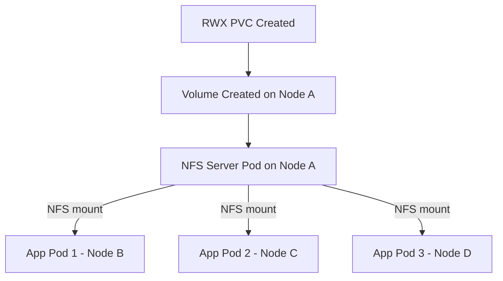

# ReadWriteMany (RWX) Volumes - User Guide

## Overview

Flint CSI driver supports **ReadWriteMany (RWX)** volumes, allowing multiple pods across different nodes to read and write to the same volume simultaneously. This is implemented using an integrated NFSv3 server.

## Quick Start

### 1. Enable NFS Support

Edit your Helm values:

```yaml
# values.yaml
nfs:
  enabled: true  # Enable RWX support
```

Deploy or upgrade:

```bash
helm upgrade flint-csi ./flint-csi-driver-chart \
  --set nfs.enabled=true \
  --reuse-values
```

### 2. Create an RWX PVC

```yaml
apiVersion: v1
kind: PersistentVolumeClaim
metadata:
  name: shared-data
spec:
  accessModes:
    - ReadWriteMany  # ← Request RWX
  resources:
    requests:
      storage: 10Gi
  storageClassName: flint
```

### 3. Use in Multiple Pods

```yaml
apiVersion: apps/v1
kind: Deployment
metadata:
  name: multi-writer
spec:
  replicas: 3  # Multiple pods share the same volume
  template:
    spec:
      containers:
      - name: app
        image: your-app:latest
        volumeMounts:
        - name: data
          mountPath: /shared
      volumes:
      - name: data
        persistentVolumeClaim:
          claimName: shared-data  # Same PVC across all pods
```

## How It Works

### Architecture



1. **Volume Creation**: CSI controller creates the volume (single or multi-replica)
2. **NFS Server**: An NFS server pod is automatically deployed on a node with the volume replica
3. **Client Mounts**: All pods mount the volume via NFS (not direct ublk access)
4. **Concurrent Access**: Multiple pods can read/write simultaneously

### NFS Server Pod

- **Naming**: `flint-nfs-<volume-id>`
- **Image**: `flint-nfs-server` (configured in Helm values)
- **Placement**: Runs on a node with the volume replica (for local access)
- **Port**: 2049 (standard NFS port)
- **Lifecycle**: Automatically created/deleted with the PVC

## Configuration

### Helm Values

```yaml
nfs:
  # Enable/disable NFS support (default: false)
  enabled: true
  
  # NFS server port (default: 2049)
  port: 2049
  
  # Resource limits for NFS server pods
  resources:
    requests:
      memory: "128Mi"
      cpu: "100m"
    limits:
      memory: "256Mi"
      cpu: "500m"
  
  # Namespace for NFS pods (default: same as CSI driver)
  namespace: ""

# NFS server image configuration
images:
  flintNfsServer:
    name: flint-nfs-server
    tag: latest
    pullPolicy: IfNotPresent
```

### StorageClass Parameters

RWX volumes use the same StorageClass as RWO volumes:

```yaml
apiVersion: storage.k8s.io/v1
kind: StorageClass
metadata:
  name: flint
provisioner: flint.csi.storage.io
parameters:
  # Single replica (default)
  numReplicas: "1"
  
  # Or multi-replica for HA
  # numReplicas: "3"
  
  # Thin provisioning (optional)
  thinProvision: "true"
```

## Use Cases

### ✅ Ideal For

- **Shared Configuration**: Config files accessed by multiple services
- **Collaborative Workloads**: Multiple writers to shared logs
- **Content Management**: Shared media/document storage
- **Multi-Pod Applications**: Distributed apps needing shared state

### ❌ Not Recommended For

- **Databases**: Use RWO with replication instead
- **High-Performance Computing**: Network overhead may impact performance
- **Single-Writer Workloads**: Use RWO for better performance

## Performance Considerations

| Access Type | Throughput | Latency | Use Case |
|-------------|-----------|---------|----------|
| **Local (NFS server pod)** | ~1-2 GB/s | ~100μs | Best performance |
| **Remote (client pods)** | ~500-800 MB/s | ~500μs | Network-dependent |

**Tips for Better Performance:**
- Use `numReplicas: "1"` for best performance (single replica, local NFS access)
- Place frequently-accessed pods on the same node as the NFS server if possible
- Use `readOnly: true` for read-only access when possible

## Access Modes Comparison

| Mode | Abbreviation | Concurrent Pods | Nodes | Implementation |
|------|--------------|-----------------|-------|----------------|
| **ReadWriteOnce** | RWO | 1 | 1 | ublk device (fastest) |
| **ReadOnlyMany** | ROX | Many | Many | NFS (read-only mount) |
| **ReadWriteMany** | RWX | Many | Many | NFS (read-write) |

## Troubleshooting

### PVC Stuck in Pending

**Symptom**: PVC stays in `Pending` state

**Check**:
```bash
kubectl describe pvc <pvc-name>
```

**Common Causes**:
1. **NFS disabled**: `nfs.enabled=false` in Helm values
   - Solution: Enable NFS in Helm values and upgrade
2. **No storage capacity**: No nodes have free space
   - Solution: Add more nodes or free up space

### NFS Server Pod Not Starting

**Symptom**: `flint-nfs-<volume-id>` pod not running

**Check**:
```bash
kubectl get pods -A | grep flint-nfs
kubectl describe pod flint-nfs-<volume-id>
```

**Common Causes**:
1. **Image pull error**: NFS server image not available
   - Solution: Build and push `flint-nfs-server` image
2. **Insufficient resources**: Node doesn't have enough CPU/memory
   - Solution: Adjust `nfs.resources` in Helm values
3. **RBAC issues**: Controller doesn't have pod create permissions
   - Solution: Verify RBAC configuration (should be automatic)

### Pods Can't Mount NFS

**Symptom**: Pods stuck in `ContainerCreating` with mount errors

**Check**:
```bash
kubectl describe pod <pod-name>
kubectl logs <pod-name>
```

**Common Causes**:
1. **NFS server not ready**: Pod starting but NFS server not listening yet
   - Solution: Wait 60s for NFS server to be ready
2. **Network policy**: Pods can't reach NFS server on port 2049
   - Solution: Check network policies, allow port 2049
3. **NFS client missing**: Node doesn't have NFS client
   - Solution: Install `nfs-common` package on nodes

### Data Not Shared Across Pods

**Symptom**: Different pods see different data

**Verify It's Actually RWX**:
```bash
kubectl get pvc <pvc-name> -o yaml | grep -A 5 accessModes
# Should show "ReadWriteMany"
```

**Check NFS Mount**:
```bash
# In each pod
mount | grep nfs
# Should show same NFS server IP
```

### Performance Issues

**Symptom**: Slow read/write performance

**Check**:
1. **Network**: NFS is network-based, expect ~500MB/s over network
2. **Concurrent Access**: Many pods writing simultaneously can cause contention
3. **NFS Server Location**: Check if NFS pod is on a different node than clients

**Optimize**:
- Use local access when possible (run app pods on same node as NFS server)
- Consider RWO if only one writer is needed
- Use read-only mounts for read-heavy workloads

## Migration from RWO to RWX

**Warning**: Cannot change access mode on existing PVC

To migrate:

1. **Create new RWX PVC**:
   ```bash
   kubectl apply -f rwx-pvc.yaml
   ```

2. **Copy data** (if needed):
   ```bash
   kubectl run copier --image=busybox --restart=Never -- \
     sh -c "cp -a /old/* /new/"
   ```

3. **Update deployments** to use new PVC

4. **Delete old RWO PVC** when migration complete

## Monitoring

### Check NFS Server Pods

```bash
# List all NFS server pods
kubectl get pods -A -l app=flint-nfs-server

# Get details of specific NFS pod
kubectl describe pod flint-nfs-<volume-id> -n flint-system

# View NFS server logs
kubectl logs flint-nfs-<volume-id> -n flint-system
```

### Check Volume Context

```bash
# View PV details (includes NFS metadata)
kubectl get pv <pv-name> -o yaml

# Look for nfs.flint.io/* keys in volumeAttributes
```

### Debug NFS Mounts

```bash
# From inside a pod
mount | grep nfs

# Check NFS stats
nfsstat

# Test NFS connectivity
telnet <nfs-server-ip> 2049
```

## Examples

### Shared Configuration Files

```yaml
---
apiVersion: v1
kind: PersistentVolumeClaim
metadata:
  name: config-share
spec:
  accessModes:
  - ReadWriteMany
  resources:
    requests:
      storage: 1Gi
  storageClassName: flint
---
apiVersion: apps/v1
kind: Deployment
metadata:
  name: config-reader
spec:
  replicas: 5
  template:
    spec:
      containers:
      - name: app
        image: myapp:latest
        volumeMounts:
        - name: config
          mountPath: /etc/config
          readOnly: true  # Read-only mount
      volumes:
      - name: config
        persistentVolumeClaim:
          claimName: config-share
```

### Multi-Writer Logging

```yaml
---
apiVersion: v1
kind: PersistentVolumeClaim
metadata:
  name: shared-logs
spec:
  accessModes:
  - ReadWriteMany
  resources:
    requests:
      storage: 10Gi
  storageClassName: flint
---
apiVersion: apps/v1
kind: DaemonSet
metadata:
  name: log-collector
spec:
  template:
    spec:
      containers:
      - name: collector
        image: log-collector:latest
        volumeMounts:
        - name: logs
          mountPath: /logs
      volumes:
      - name: logs
        persistentVolumeClaim:
          claimName: shared-logs
```

## FAQ

### Q: Can I use RWX and RWO volumes in the same cluster?

**A**: Yes! RWO volumes continue to work exactly as before. RWX is only used when explicitly requested in the PVC's `accessModes`.

### Q: What happens if the NFS server pod crashes?

**A**: Kubernetes will restart it automatically. Client pods may see temporary I/O errors during the restart (typically <30 seconds). Consider using retry logic in applications.

### Q: Can I have multiple NFS server pods for the same volume (HA)?

**A**: Not in the current implementation. Each RWX volume has one NFS server pod. For HA, use multi-replica volumes (`numReplicas: "3"`), which ensures data durability even if a node fails.

### Q: How do I disable RWX support?

**A**: Set `nfs.enabled=false` in Helm values and upgrade. Existing RWX volumes will stop working, but RWO volumes are unaffected.

### Q: Does RWX work with snapshots?

**A**: Yes! You can create snapshots of RWX volumes and restore them. The restored volume will also be RWX.

### Q: What's the maximum number of pods that can use one RWX volume?

**A**: Theoretically unlimited, but practical limit depends on workload. Tested with 10+ pods successfully. Network and NFS server resources may become bottlenecks with very high pod counts.

## Support

For issues, questions, or feature requests:
- **GitHub Issues**: [Project Repository]
- **Design Docs**: See `RWX_NFS_DESIGN.md` for architecture details
- **Internal Docs**: See `ZERO_REGRESSION_DESIGN.md` for safety guarantees

---

**Version**: 1.0  
**Last Updated**: 2025-12-06  
**Feature Status**: Beta (feature branch: `feature/rwx-nfs-support`)

