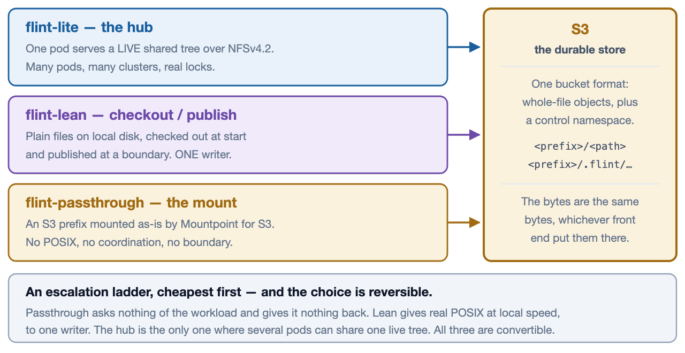
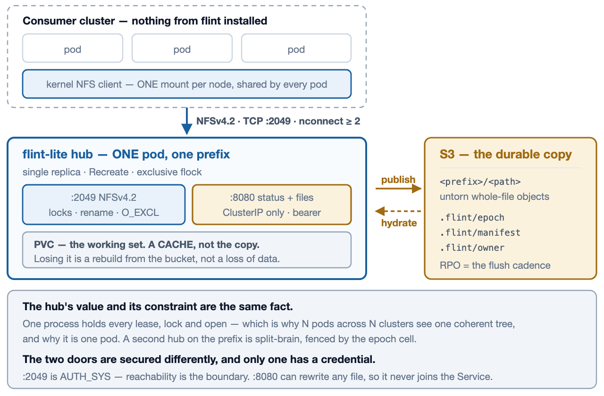
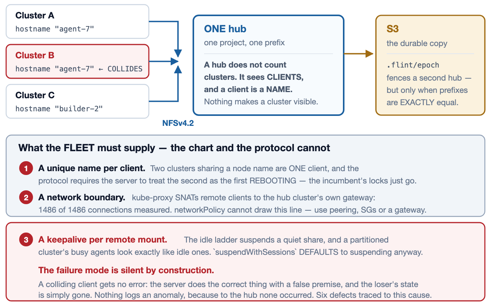
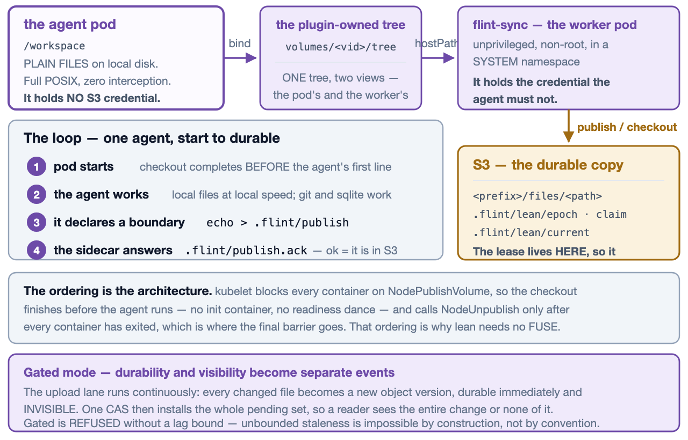
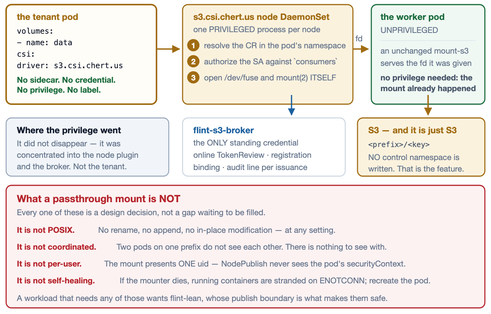

# flint front ends

> Three ways to put an S3 bucket in front of a workload — **flint-lite**, **flint-lean** and **flint-passthrough** — with the multi-cluster and security consequences of each, and the one durable store they all share.

**Scope.** The architecture of the three front ends as built, the fleet shape each implies when one user launches agents across several Kubernetes clusters, what identity is actually enforced on the data path, and where S3 sits in all three. Every claim here is drawn from the repository at the revision noted below; where a guarantee has a stated ceiling, the ceiling is stated rather than rounded up.

**Sources of record.** `docs/plans/csi-node-mount-design.md` (the CSI delivery), `docs/plans/flint-lean-plan.md`, `docs/flint-lite-architecture.html`, `docs/flint-lean-architecture.html`, the three charts, and the code under `spdk-csi-driver/src/{s3csi,passthrough,tier,lite_operator,lean_operator}` and `lean/sidecar/src`.

**Regenerating.** `docs/architecture/build.sh`. The diagrams are standalone SVG files under `diagrams/`, referenced rather than inlined, so they can be reused in any other format; the build also emits a Markdown rendition for conversion.

## Contents

- **1 · Three front ends, one bucket** — the shape of the choice, and what is common underneath it.
- **2 · flint-lite — the hub** — one pod as the coherence authority, a PVC as cache, S3 as the copy.
- **3 · flint-lite across clusters** — one hub, many clusters, and the three things the fleet must supply.
- **4 · flint-lean — checkout and publish** — plain local files, one writer, a boundary the agent declares.
- **5 · flint-passthrough — the CSI mount** — a prefix mounted as-is, and where the privilege went.
- **6 · Where a user's token can and cannot go** — what each front end actually authenticates.
- **7 · Fleet shape and blast radius** — what you install per cluster, and what one compromised pod reaches.
- **8 · S3 — the durable store** — the live view, the published view, and the recovery point of each.
- **9 · Choosing** — ten dimensions, three columns, one decision.

## Three front ends, one bucket

*1 / 9 · overview*

flint puts a bucket in front of a workload three different ways. They are not three configurations of one thing and not three tiers of the same product: they are three different bargains, each coherent with itself, over one common bucket format. What varies is how much the workload gets and how much machinery has to exist for it to get that.

**Read the columns as an escalation ladder, cheapest first.** **Passthrough** asks nothing of the workload — nine lines of pod spec — and gives it nothing back beyond the objects: no POSIX, no coordination, no boundary. **Lean** gives a real local filesystem at disk speed to one writer, and a durable point that writer can name. **The hub** is the only one of the three where several pods, in several clusters, can share one live tree with locks that mean something.

**The common floor is the bucket format, and it is what makes the choice reversible.** All three write whole-file objects; what differs is the `.flint/` control namespace beside them, which exists to answer questions the object listing cannot — who holds the write lease, what the last coherent boundary contained, what the whole tree is for a restore. Passthrough writes no control namespace at all, which is exactly why it can be pointed at a prefix somebody else's tooling already owns. Because the formats are common and mutually convertible, a volume that outgrows one front end can move to another rather than being re-plumbed.

## flint-lite — the hub

*2 / 9 · architecture*

One pod serves real POSIX over NFSv4.2 to any number of pods in any number of clusters. The PVC beside it is a working set; an S3 prefix is the durable copy. A second listener exposes the same filesystem over HTTP for callers that cannot mount. One hub serves exactly one prefix — a project that needs several volumes runs several hubs.

**The hub's value and its constraint are the same fact.** One process holds every lease, lock and open, so N pods across N clusters see one coherent tree — and that is why it is one pod, one replica, `Recreate`, behind an exclusive flock. Two hubs on one prefix would be split-brain, which the store-side epoch cell fences and the operator refuses up front. Consumers install nothing: the data path is the node's own kernel NFS client, one mount per node, shared by every pod on it along with its page cache.

**The disk is a cache; the bucket is the copy.** The hub flushes the working set to S3 on a cadence, so the recovery point is that cadence and losing the PVC is a rebuild rather than a loss. A cold read hydrates on demand and both doors say so rather than hanging — NFS parks the caller with `NFS4ERR_DELAY`, HTTP answers `503 + Retry-After`. **The two doors are secured differently, and only one of them has a credential.** Port 2049 is AUTH_SYS, so the client asserts its own uid and reachability is the real boundary; port 8080 can rewrite every file in the share, so it stays ClusterIP-only, never joins the Service, and mounts no routes at all without a bearer token — `404`, not `401`. That token is per-share, not per-user, which page 6 takes up.

## flint-lite across clusters

*3 / 9 · multi-cluster*

One hub can serve agents in several clusters at once. The wire is ordinary NFSv4.2 and the hub does not know, or care, how many clusters are on it — which is precisely the problem. Three things the protocol and the chart cannot supply become the fleet's responsibility, and every one of them fails silently if it is missed.

**A hub does not count clusters — it sees clients, and a client is a name.** The NFSv4 client identity is the hostname and nothing else, so two clusters that share a node name are one client to the hub, and RFC 8881 §18.35.5 requires the server to read the second as the first rebooting: the incumbent's locks and opens go, silently, correctly, on a false premise. Six defects in v1.37.0 traced to this one cause. Fix it with `hostname = <cluster>-<node>`, or the client-side kernel parameter `nfs.nfs4_unique_id`, which survives a rename.

**The reachability boundary cannot be drawn where you would expect to draw it.** kube-proxy SNATs a NodePort or LoadBalancer client to an address in the hub's own cluster before the packet arrives: measured on a three-cluster rig, 1486 of 1486 connections from two remote clusters arrived as the hub cluster's gateway, none as either remote node. Listing remote CIDRs in `networkPolicy` is an outage; listing the local one admits everyone. Use peering, security groups, or a gateway. **And a partitioned cluster's busy agents look exactly like idle ones** — `suspendWithSessions` defaults to suspending anyway, and even when set it only narrows the window, because leases expire. Drive `POST /wake` from the thing that actually knows whether work is happening.

## flint-lean — checkout and publish

*4 / 9 · architecture*

If the workspace fits on disk, no interception is needed at all. Materialize plain files before the agent's first line runs, publish changed files at cadence or at a boundary the agent declares, and keep the write authority out of the pod. Most of a FUSE front end's value at a fraction of its risk surface — same bucket, same engine, no kernel path.

**The ordering is the architecture.** kubelet blocks every container in the pod on `NodePublishVolume`, so the checkout completes before the agent's first line runs — no init container, no readiness dance — and calls `NodeUnpublishVolume` only after every container has exited, which is where the final barrier goes. In between, the app touches plain files on real local disk with zero interception, so git, sqlite, hard links and index locks simply work. The app container holds no S3 credential; the unprivileged worker does, in a system namespace, behind a loopback door the app cannot reach.

**The boundary verbs are files, because the workspace is the interface.** An agent that can write a file can declare a coherent point — `echo > .flint/publish` — and learn when its bytes are durable, from `.flint/publish.ack`: `ok` means the bytes are in S3, `refused-fenced` means this syncer lost the lease and is saying so rather than leaving the agent waiting forever. No client library, no credential, no network path. **Gated mode answers a different question from cadence:** cadence asks how stale a reader may be, gated asks whether a reader may see half a logical change — and answers no, by uploading every changed file as a new version immediately (durable, and invisible) and installing the whole pending set with one CAS. Gated is refused without a lag bound, so unbounded staleness is impossible by construction rather than by convention.

## flint-passthrough — the CSI mount

*5 / 9 · architecture*

An S3 prefix, mounted into a pod as-is by Mountpoint for S3, with no flint semantics layered over it. There is no controller and no status, because nothing about a passthrough mount converges. What there is, is a careful answer to the question of who holds privilege — and the answer is: not the tenant.

**The trick is that the mount happens before the mounter runs.** The node plugin opens `/dev/fuse` and calls `mount(2)` itself — the one act that genuinely needs privilege, done once, per node — then hands the file descriptor to an unprivileged worker pod over `SCM_RIGHTS`, where an unchanged `mount-s3` serves it needing no privilege at all. The tenant pod is given nothing: no sidecar, no label, no webhook, no credential, no privileged container. It declares a `csi:` volume naming a CR in its own namespace and stays admissible under PodSecurity `restricted`.

**Privilege did not disappear; it was concentrated.** It lands in exactly three places, none of them a tenant namespace: the node plugin (privileged, one per node, holding no S3 credential and no Secrets RBAC), the worker pods (non-root, all capabilities dropped, read-only rootfs, no ServiceAccount token), and the broker (the only standing credential, and every issuance is TokenReview-verified and audit-logged). **What a passthrough mount is not** is worth stating as plainly as what it is: not POSIX — no rename, no append, no in-place modification at any setting; not coordinated — two pods on one prefix do not see each other; not per-user — the mount presents one uid, because `NodePublish` never sees the pod's `securityContext`; and not self-healing — if the mounter dies, running containers are stranded on `ENOTCONN` and the pod must be recreated. A workload that needs any of those wants flint-lean.

## Where a user's token can and cannot go

*6 / 9 · identity and security*

One human launches agents across clusters A, B and C. Each agent holds that user's token — short-lived, from an IdP, and possibly a different token in each cluster. This page answers the only question that matters for isolating one user's work from another's: what does storage actually check, and where could that token be presented if you wanted it to be?

|  | flint-lite | flint-lean | flint-passthrough |
|---|---|---|---|
| What the agent holds | The user's token, and it never sends it anywhere — there is no door on the data path that would read one. It holds no bucket credential either. | The user's token, unused for storage, and **no S3 credential at all**. The credential lives in the worker, behind a loopback door the app container cannot reach. | The user's token, unused for storage, and **no S3 credential at all**. The pod is given nothing: no sidecar, no label, no privilege, no webhook. |
| The door, and what it validates | **Nothing.** Port 2049 is AUTH_SYS: the client asserts its own uid and the server takes it. `security.enforcePermissions` defaults to `false`, so the POSIX check logs and then allows; even enforced, the hub holds `CAP_DAC_OVERRIDE`. | **flint-s3-broker.** Online TokenReview of the pod's ServiceAccount token (a deleted pod's token dies within 60 s, not at `exp`); a session name matching a live registration the plugin made for that pod-uid and CR, which a pod cannot self-mint; and the CR's `consumers` list in the token's own namespace. | **flint-s3-broker** — the identical chain. Same TokenReview, same registration binding, same `consumers` gate, same audit line `(ns, sa, pod-uid, cr, expiry)`. |
| What storage sees | A client **name** — the hostname — and a self-declared uid. Not a user, and not a cluster: two clusters sharing a node name are one client. The file API's bearer token is per-share, not per-user. | Short-lived keys scoped to the project's prefix, minted per pod. Never the user, and never a standing key anything a tenant can reach holds. | Short-lived keys scoped to the bucket and prefix in the CR. Inside the pod the mount reports **one uid** for every file, because NodePublish never sees the pod's `securityContext`. |
| What isolates user A from user B | **Nothing inside the hub.** Draw it outside: one hub per project (already the model — one CR, one prefix, one coherence domain) plus a real network boundary, since `networkPolicy` provably cannot draw it. | **The prefix and the lease.** One workspace is one prefix and the keys are scoped to it; the subtree lease admits exactly one writer and lives in the **bucket**, so it holds across clusters. | **The prefix and the CR — nothing finer than a pod.** `consumers` decides which ServiceAccounts may mount it. Give each user their own CR and their own pod. |

**The answer, for all three, is that the user's token does not reach the data path.** Every front end authenticates the workload, never the human behind it — so the fact that each agent may carry a different token is invisible to flint. For lean and passthrough that is a feature: the enforced identity is the pod's ServiceAccount, kubelet-minted and pod-bound, so token churn upstream changes nothing. For lite it is a gap: **nothing on the NFS wire carries a user identity, and there is no field to add one to.**

**flint-lite authenticates nobody on port 2049.** AUTH_SYS means the client asserts its own uid and the server takes it, and the POSIX check is not a backstop either: `security.enforcePermissions` defaults to `false`, which evaluates the mode, logs the answer, and allows the operation anyway — and even enforced, the hub holds `CAP_DAC_OVERRIDE`. What `sec=sys` buys is identity, so `ls -l` tells the truth; it is not a boundary between tenants sharing a hub. The file API's bearer token is per-share, not per-user. So isolation must be drawn outside the hub, which the one-hub-per-project model already does: **one CR, one prefix, one coherence domain, and a real network boundary around it.**

**flint-lean and flint-passthrough share one identity chain, and it is a strong one.** The broker verifies the pod's token with an *online* TokenReview — a deleted pod's token dies within 60 seconds rather than at `exp` — requires a session name matching a live registration the node plugin made for that pod-uid and CR, which a pod cannot self-mint, and checks the CR's `consumers` list in the token's own namespace, never a request field, where absent means deny. One broker per cluster is required, because TokenReview runs against the local API server: clusters meet in the bucket, not at each other's brokers. The broker's `rest` backend is the one seam where a user-scoped token could be honoured — it POSTs the pod's token to the application's own JWT-enforcing API and takes back project-scoped keys — but what it carries today is the pod's identity, not the user's.

## Fleet shape and blast radius

*7 / 9 · multi-cluster and security*

Two practical questions for anyone running agents on more than one cluster: what do I have to install in each of them, and if one agent pod is fully compromised, what does the attacker now have? The three front ends answer both differently, and the cheapest to install is not the one with the smallest blast radius.

|  | flint-lite | flint-lean | flint-passthrough |
|---|---|---|---|
| Installed in the home cluster | The operator (or one chart release per hub), and the Deployment, Service, ConfigMap and PVC it renders. Optionally the hub gateway. | The CSI node DaemonSet, a broker, and the lean CRD plus a thin controller — the same list as every other cluster. | The CSI node DaemonSet and a broker, plus the CRD. There is no workload in the passthrough chart and no controller behind the CR. |
| Installed in every consumer cluster | **Nothing.** The data path is the node's own kernel NFS client; at most a PV and PVC, or the stock nfs-subdir provisioner, which never carries a byte. | The same three components, in **every** cluster. The broker must be local, because TokenReview runs against the local API server. | The same CSI driver and broker, in every cluster. One CSI install serves lean and passthrough together. |
| Cross-cluster dependency | The hub cluster becomes a dependency of every other one, and holds the only copy of the live tree that is not in S3. | **None.** Clusters never talk; they meet in the bucket, where a CAS on the lease keeps them honest — so single-writer holds across clusters. | **None.** S3 is already a multi-cluster service, and nothing is shared except the objects. |
| Blast radius of one compromised agent pod | **The whole share.** The pod has the mount, asserts its own uid, and the permission check logs rather than refuses. It cannot reach the bucket — the hub holds that credential. Everything sharing a hub shares a fate. | **The workspace, not the bucket.** The attacker gets the tree it was working in, published under its own prefix. The honest ceiling: a deposed writer is refused at the control plane, not fenced on the data plane, so its writes land as uncited versions a raw-key reader can still see. | **The prefix, as mounted**, at the CR's `readOnly` setting — the tightest of the three, because there is nothing else there to take. Scope the CR and you have scoped the breach. |

**flint-lite has the cheapest fleet onboarding and the widest blast radius.** Consumer clusters install nothing at all — the data path is the node's own kernel NFS client — but the hub cluster becomes a dependency of every other one, and a compromised pod already holds the mount. With AUTH_SYS and a log-only permission check, it reads and writes every file in the share as anyone. It cannot reach the bucket, because the hub holds that credential and the pod has none; that much is genuinely contained. Everything sharing a hub shares a fate, so size hubs by the blast radius you are willing to accept, not only by capacity.

**flint-lean and flint-passthrough cost a per-cluster install and buy a much smaller radius.** Each cluster runs the same CSI node driver and its own broker; no cluster depends on any other, and they meet only in the bucket — where the lean lease is a CAS no cluster can route around, which is the one guarantee lite's admission check cannot make, since it only ever sees its own cluster. A compromised lean pod gets the tree it was already working in, published under its own prefix; it does not get the bucket, other workspaces, or a credential that outlives the pod. **The honest ceiling is that lean refuses a deposed writer at the control plane, not on the data plane:** its writes land as uncited versions that no coherent reader resolves, but a raw-key reader can still see them. That is a chosen ceiling — closing it needs per-request epoch validation at a proxy, which is a component this front end exists to avoid.

**Passthrough is the tightest, for a dull reason: there is nothing else there to take.** The pod gets the prefix in the CR at the CR's `readOnly` setting, with short-lived scoped keys it never sees. Scope the CR and you have scoped the breach. The residual risk is the single uid: every process in the pod shares one mount, so pod-level isolation is the finest granularity available.

## S3 — the durable store

*8 / 9 · durability*

Underneath all three front ends there is one durable store, and it is S3. Everything above it — the hub's disk, the lean workspace, the FUSE mount — is a way of reaching bytes whose home is the bucket. Two views of those bytes exist, with different contracts, and confusing them is the most common way to get hurt here.

|  | flint-lite | flint-lean | flint-passthrough |
|---|---|---|---|
| Object keys | `<prefix>/<path>` — the published generations, as untorn whole-file objects. | `<prefix>/files/<path>` — the workspace, file for file. | `<prefix>/<key>` — the objects, and nothing else. |
| Control namespace | `.flint/epoch` (who is the hub now), `.flint/manifest` (the whole tree, for DR from one GET), `.flint/owner`. | `.flint/lean/epoch` and `claim` (who may write this subtree), `manifest`, `inbox`, `conflicts/`. | **None, deliberately.** A prefix another system already owns stays exactly as it was, and no trace is left when the pod goes away — but you get no answer to any question on the left. |
| Recovery point after a hard kill | The flush cadence. The PVC is a cache: losing it is a rebuild from the bucket, not a loss. | The last barrier — at most `floorSecs` (default 60 s), zero on a graceful stop, and zero *and acknowledged* if the agent declares a boundary. | **None** — nothing is buffered on flint's behalf. A completed PUT is durable; an interrupted one did not happen. |
| What a reader of the bucket sees | RPO-consistent whole-file snapshots. The live view is port 2049, and it is never in the bucket. | The last published boundary. In gated mode a reader sees the whole change or none of it, never a mixture. | Whatever S3 currently holds, with S3's own consistency and nothing added. |

**The live view is strong and is never in the bucket.** It is a hub's port 2049 and file API, or a lean workspace's local disk: close-to-open, byte-range locks, atomic rename, no RPO lag. The published view is the bucket: RPO-consistent snapshots per subtree, made of untorn whole-file generations. A reader of the bucket never sees half a file, and may well see a file from before your last write — that is the contract, not a defect. Anything that is not a mount reads the published view as plain S3, with no flint server in the read path at all. **Do not write into a live subtree from the console:** a hand-made PUT under a prefix a hub or syncer owns is overwritten at the next flush, reported as a conflict, or silently uncited.

**Every control cell exists to answer a question the object listing cannot.** Who is the hub right now, and may I become it — the epoch lease. What does the last coherent boundary contain — the manifest, which also makes disaster recovery a single GET rather than a crawl. Who owns this prefix, and did state loss change that — the claim and owner cells. The claim is checked on the data path itself: a syncer reads it before it takes the lease and refuses a prefix another project holds, so refuse-foreign does not wait on an operator's verdict. Passthrough writes none of them, which is why it can be pointed at a prefix another system already owns and leaves no trace when the pod goes away; it also gets no answer to any of those questions. `.flint` is reserved and enforced from both sides: a client file cannot shadow a control object, and a nested `.flint/` is another share's namespace, never tiered into this one.

**The recovery point differs, and it is worth stating in the language of a hard pod kill.** Lite loses up to the flush cadence, and its PVC is a cache — losing the disk is a rebuild. Lean loses at most `floorSecs` (default 60 s), zero on a graceful stop, and zero-and-acknowledged if the agent declares a boundary; a stop whose drain could not finish keeps the tree on the node, under the plugin's `undrained/`, and says so on the pod. Passthrough has no recovery point at all, because nothing is buffered on flint's behalf: a completed PUT is durable and an interrupted one did not happen. That is the strongest durability story of the three, and it is strongest because flint is not in it.

## Choosing

*9 / 9 · decision*

Ten dimensions, three columns. Read it down a column rather than across a row: each front end is coherent with itself, and the rows that look like weaknesses are usually the price of a strength two rows up.

| Dimension | flint-lite | flint-lean | flint-passthrough |
|---|---|---|---|
| What the pod sees | A shared NFS mount served by one hub pod that every client reaches over the network — one tree, many pods, live. | Plain files on local disk, checked out before the first line runs and published back on a boundary — one pod's own tree. | An S3 prefix presented as files by Mountpoint for S3 — objects, with a directory-shaped view over them. |
| POSIX fidelity | **Full, and shared.** Byte-range locks, atomic rename, `O_EXCL` — across pods and clusters. | **Full, and local.** A real filesystem, so git, sqlite and hard links work — for one pod. | **None to speak of.** No rename, no append, no in-place write, at any setting. |
| Concurrent writers per tree | **Many, coordinated.** The only front end where two pods can edit one directory and both be right. | **Exactly one, enforced.** A second syncer is refused, not merged; several agents integrate through a git host instead. | **Many, uncoordinated.** Two writers on one key race; the loser's write is gone and nothing records it. |
| What a reader sees | The live tree, strongly — close-to-open, no RPO lag, through the coherence authority. | The last **published** boundary, never your last write; gated mode makes it all-or-nothing. | Whatever S3 currently holds, with S3's own consistency and nothing added. |
| Across clusters | ONE hub, mounted from N clusters. Works unchanged — but needs unique client names, a network boundary and a keepalive. | N independent syncers, one bucket. Clusters never talk; the lease lives in the bucket, so single-writer holds across clusters. | N independent mounts, one bucket. There is no fleet problem, because nothing is shared to get wrong. |
| Identity that is enforced (the user's token reaches none of these) | **Nobody, on the data path.** AUTH_SYS: the client asserts its own uid, and the POSIX check defaults to log-only. | **The pod's ServiceAccount** — kubelet-minted, pod-bound, verified online by TokenReview and checked against `consumers`. | **The pod's ServiceAccount** — an identical chain to lean: same broker, same registration binding, same audit line. |
| Isolating user A from user B | Give each project its own hub and prefix, and bound reachability outside Kubernetes. Everything sharing a hub shares a fate. | Give each user their own workspace prefix. Keys are scoped to it, the lease fences it, and `consumers` says who may mount it. | Give each user their own CR and pod. The mount presents one uid, so pod-level isolation is user-level isolation. |
| Installed per consumer cluster | **Nothing.** The node's own kernel NFS client is the data path; at most a PV and PVC. | The CSI driver, a broker, and the lean CRD plus thin controller — in **every** cluster (the broker must be local). | The CSI driver, a broker and the CRD, in every cluster. One CSI install serves lean and passthrough together. |
| Recovery point | The flush cadence. The PVC is a cache — losing it is a rebuild from S3, not a loss. | The last barrier: at most `floorSecs` (default 60 s), or zero and acknowledged if you declare one. | **None — nothing is buffered.** A completed PUT is durable; an interrupted one did not happen. |
| Choose it when | **Several pods must share one LIVE tree.** Shared workspaces, cross-pod locking, a dataset too big for a pod's disk. | **One agent owns a workspace that fits on disk.** Full POSIX at local speed, durable at breakpoints, agents integrating through git. | **You want the bucket, not a filesystem.** Read-mostly datasets, weights, artifacts, or a prefix another system already owns. |

**The short form.** Choose **flint-lite** when several pods must share one live tree — shared workspaces, cross-pod locking, a dataset larger than a pod's disk, or anything needing a filesystem two pods can both see. Choose **flint-lean** when one agent owns a workspace that fits on disk and wants full POSIX at local speed with a durable point it can name; several agents then integrate through a git host rather than through the bucket. Choose **flint-passthrough** when you want the bucket rather than a filesystem — read-mostly datasets, weights, artifacts, or a prefix another system already owns that you want visible inside a pod without changing it.

**The multi-cluster and security rows are the ones most often decided late and regretted.** If one user's agents must be isolated from another's, none of the three will do it for you inside the data path: the unit of isolation is the prefix, and the thing that enforces it is either a network boundary around a hub, or a broker scoping short-lived keys to a CR. Decide the prefix layout first and the front end second. **And because the bucket format is common and the front ends are mutually convertible, a volume can change its mind later** — which is the strongest argument for starting with the cheapest bargain that works rather than the most capable one.
