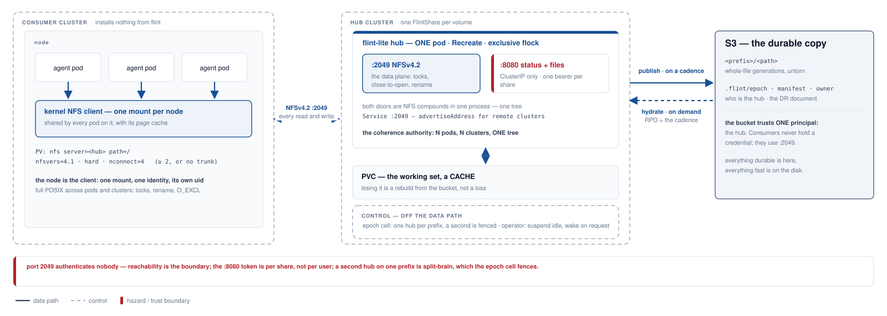
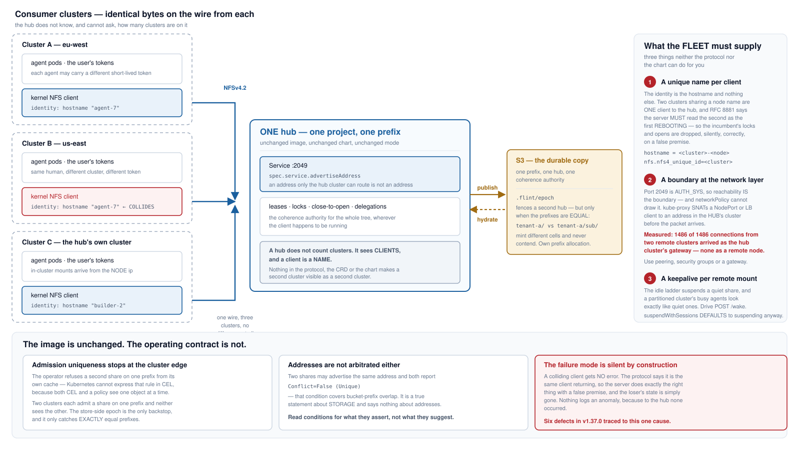
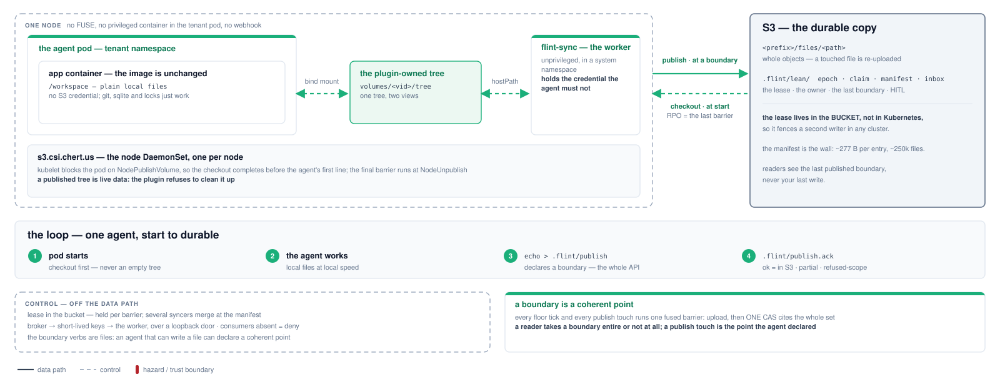
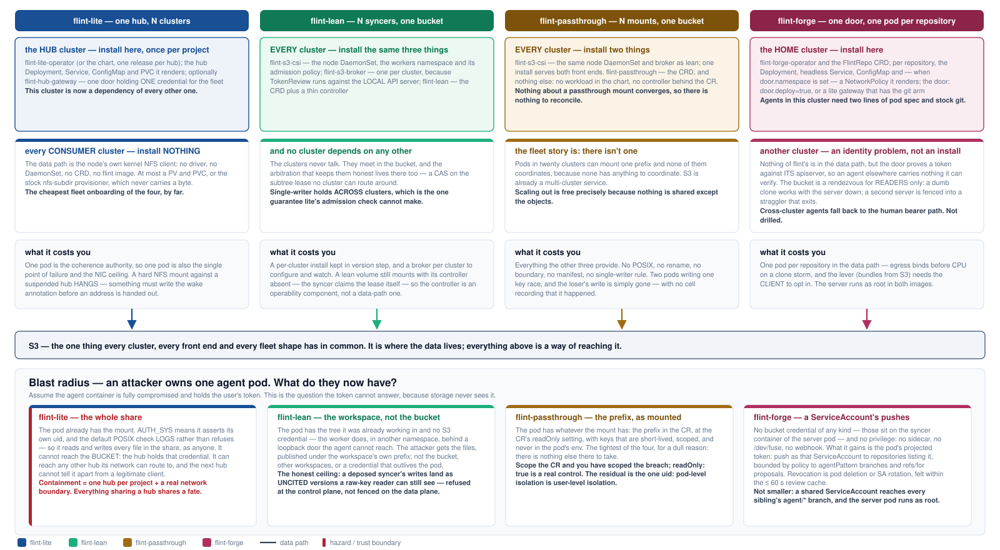

# flint front ends

> Four ways to put an S3 bucket in front of a workload — **flint-lite**, **flint-lean**, **flint-passthrough** and **flint-forge** — with the multi-cluster and security consequences of each, the one durable store they all share, and how they compose. In one word each: lite is **NFS**, lean is **sync**, passthrough is **FUSE**, forge is **git**.

**Scope.** The architecture of the four front ends as built, the fleet shape each implies when one user launches agents across several Kubernetes clusters, what identity is actually enforced on the data path, the security posture of each, where S3 sits in all four, and the rule under which they can be used together. Every claim here is drawn from the repository at the revision noted below; where a guarantee has a stated ceiling, the ceiling is stated rather than rounded up, and where a drill refuted a claim the drill wins.

**Four technologies.** The word names what carries the bytes between the workload and the bucket, and it is the first row of the table on page 13. **flint-lite is NFS**: a hub pod serves the tree over NFSv4.2 and the node's kernel client carries every byte. **flint-lean is sync**: the agent writes an ordinary local directory, and a sidecar process copies changed bytes to S3 with the plain S3 API, after the fact — the way rsync or Dropbox are described. Nothing intercepts the agent's file operations, which is the defining property of FUSE, and nothing mounts the bucket, so "indirect FUSE" would be wrong; flint-lean has no FUSE anywhere. The chunked manifest, the content-addressed chunks and the barrier are how lean makes that reconciliation atomic and cheap, but they are properties of the sync, not a different mechanism. The two-word names that also fit are *local-first sync* and *S3 publisher*. **flint-passthrough is FUSE**: Mountpoint for S3 intercepts every file operation in the pod and translates it into object requests, so the bucket is what the pod touches. **flint-forge is git**: real git, served per repository, with S3 as its only durable state.

**Sources of record.** `docs/plans/csi-node-mount-design.md` (the CSI delivery), `docs/plans/flint-lean-plan.md`, `docs/flint-lite-architecture.html`, `docs/flint-lean-architecture.html`, `docs/plans/flint-forge-design.md` (§13 for the falsifiers as run, §17 for composition), `docs/plans/flint-forge-simplification-2026-09-05.md`, the four charts, the drills under `forge/e2e/` (`scale/README.md` for the large-repository campaign, `latency/`, `repack/`), and the code under `spdk-csi-driver/src/{s3csi,passthrough,tier,lite_operator,lean_operator,forge_operator,lite_gateway}`, `lean/sidecar/src` and `forge/syncer/src`. The security page also draws on the approach radar's verified Security cells (`docs/radar/`).

**Regenerating.** `docs/architecture/diagrams.py` writes every diagram; `docs/architecture/build.sh` validates, rasterises and renders. The diagrams are standalone SVG files under `diagrams/`, referenced rather than inlined, so they can be reused in any other format; the build also emits a Markdown rendition for conversion. Colour means one thing in them: which front end — the same four hues the approach radar uses.

## Contents

- **1 · Four front ends, one bucket** — the shape of the choice, and what is common underneath it.
- **2 · How the bytes move** — one picture: what carries the bytes for each front end, when they move, and what never touches them.
- **3 · flint-lite — the hub** — one pod as the coherence authority, a PVC as cache, S3 as the copy.
- **4 · flint-lite across clusters** — one hub, many clusters, and the three things the fleet must supply.
- **5 · flint-lean — checkout and publish** — plain local files, one writer, a boundary the agent declares.
- **6 · flint-passthrough — the CSI mount** — a prefix mounted as-is, and where the privilege went.
- **7 · flint-forge — the git server** — real git per repository, one syncer, and a push that is acknowledged only once it is in S3.
- **8 · Where a user's token can and cannot go** — what each front end actually authenticates.
- **9 · Fleet shape and blast radius** — what you install per cluster, and what one compromised pod reaches.
- **10 · S3 — the durable store** — the live view, the published view, and the recovery point of each.
- **11 · Security posture** — seven questions, four columns, and where each boundary is actually drawn.
- **12 · Composition** — one pod, several doors, one bucket, one writer per prefix — and what the drills found.
- **13 · Choosing** — eleven dimensions, four columns, one door per data class.

## Four front ends, one bucket

*1 / 13 · overview*

flint puts a bucket in front of a workload four different ways. They are not four configurations of one thing and not four tiers of the same product: they are four different bargains, each coherent with itself, over one bucket. Three of them are file-shaped and share a format; the fourth is git-shaped, and stores a bare repository. What varies is how much the workload gets and how much machinery has to exist for it to get that. In one word each, the technology that carries the bytes: lite is **NFS**, lean is **sync** (local disk with an S3 sync sidecar — no FUSE anywhere), passthrough is **FUSE**, forge is **git**.

**Read the columns as an escalation ladder, cheapest first.** **Passthrough** asks nothing of the workload — nine lines of pod spec — and gives it nothing back beyond the objects: no POSIX, no coordination, no boundary. **Lean** gives a real local filesystem at disk speed to one writer, and a durable point that writer can name. **The hub** is the only one where several pods, in several clusters, can share one live tree with locks that mean something. **Forge** stands slightly apart: it is for code, its unit of durability is a commit, and what it adds is history, a merge policy the server enforces, and an acknowledgement that means the bytes are in S3.

**The common floor is the bucket format, and it is what makes the file-shaped choice reversible.** Lite, lean and passthrough all write whole-file objects; what differs is the `.flint/` control namespace beside them, which exists to answer questions the object listing cannot — who holds the write lease, what the last coherent boundary contained, what the whole tree is for a restore. Passthrough writes no control namespace at all, which is exactly why it can be pointed at a prefix somebody else's tooling already owns. Forge's bucket is a bare git repository plus one CAS'd pointer, and it joins the family through its export: a ref's tree published, by the shipped lean binary, as a valid lean workspace. Because the file formats are common and mutually convertible, a volume that outgrows one front end can move to another rather than being re-plumbed — and page 12 shows that the better question is usually not which one, but which one for which data.

## How the bytes move

*2 / 13 · data flow*

The same four front ends, drawn as flows and nothing else. Read each column top to bottom: what the pod touches, what carries the bytes, and what puts them in the bucket. Solid arrows carry file contents; the dashed boxes are control — leases, tokens, keys — and never carry a file.

![The data flow of each front end as a column: for flint-lite the pod's NFS mount reaches the hub over the wire live, and the hub publishes on a cadence and hydrates on demand; for flint-lean the pod writes a local directory that a sidecar copies to S3 at a boundary, with nothing between the pod and its disk; for flint-passthrough every file operation in the pod is intercepted by mount-s3 and becomes an S3 request; for flint-forge a push carries packs to the server pod, whose syncer uploads them and acknowledges only once they are in S3. Control — the epoch cell, the lease, the broker, the door — sits beside each column and never carries a file.](diagrams/01b-data-flow.svg)

**Two of the four put nothing between the pod and its files.** A lean pod writes ordinary local disk, and the sidecar reads that same directory after the fact — the pod is never blocked on S3, never sees a credential, and never waits. A forge pod holds an ordinary clone; bytes leave it only when it pushes. The other two intercept: the hub's NFS mount carries every read and write over the wire to one process that holds the tree, and passthrough's FUSE mount turns every file operation into an object request in the pod's own critical path.

**When bytes reach the bucket is the recovery point, and the column says it.** Lite publishes on a cadence and hydrates a cold read on demand; lean publishes changed files at a boundary and checks out at start; passthrough has no moment of its own, because every operation is the request; forge uploads packs on push and reports `ok` only after the snapshot CAS lands, and restores at start. Everything in the dashed boxes decides who may do these things, and none of it is on the path the bytes take.

## flint-lite — the hub

*3 / 13 · architecture*

One pod serves real POSIX over NFSv4.2 to any number of pods in any number of clusters. The PVC beside it is a working set; an S3 prefix is the durable copy. A second listener exposes the same filesystem over HTTP for callers that cannot mount. One hub serves exactly one prefix — a project that needs several volumes runs several hubs.

**The hub's value and its constraint are the same fact.** One process holds every lease, lock and open, so N pods across N clusters see one coherent tree — and that is why it is one pod, one replica, `Recreate`, behind an exclusive flock. Two hubs on one prefix would be split-brain, which the store-side epoch cell fences and the operator refuses up front. Consumers install nothing: the data path is the node's own kernel NFS client, one mount per node, shared by every pod on it along with its page cache.

**The disk is a cache; the bucket is the copy.** The hub flushes the working set to S3 on a cadence, so the recovery point is that cadence and losing the PVC is a rebuild rather than a loss. A cold read hydrates on demand and both doors say so rather than hanging — NFS parks the caller with `NFS4ERR_DELAY`, HTTP answers `503 + Retry-After`. **The two doors are secured differently, and only one of them has a credential.** Port 2049 is AUTH_SYS, so the client asserts its own uid and reachability is the real boundary; port 8080 can rewrite every file in the share, so it stays ClusterIP-only, never joins the Service, and mounts no routes at all without a bearer token — `404`, not `401`. That token is per-share, not per-user, which page 8 takes up.

## flint-lite across clusters

*4 / 13 · multi-cluster*

One hub can serve agents in several clusters at once. The wire is ordinary NFSv4.2 and the hub does not know, or care, how many clusters are on it — which is precisely the problem. Three things the protocol and the chart cannot supply become the fleet's responsibility, and every one of them fails silently if it is missed.

**A hub does not count clusters — it sees clients, and a client is a name.** The NFSv4 client identity is the hostname and nothing else, so two clusters that share a node name are one client to the hub, and RFC 8881 §18.35.5 requires the server to read the second as the first rebooting: the incumbent's locks and opens go, silently, correctly, on a false premise. Six defects in v1.37.0 traced to this one cause. Fix it with `hostname = <cluster>-<node>`, or the client-side kernel parameter `nfs.nfs4_unique_id`, which survives a rename.

**The reachability boundary cannot be drawn where you would expect to draw it.** kube-proxy SNATs a NodePort or LoadBalancer client to an address in the hub's own cluster before the packet arrives: measured on a three-cluster rig, 1486 of 1486 connections from two remote clusters arrived as the hub cluster's gateway, none as either remote node. Listing remote CIDRs in `networkPolicy` is an outage; listing the local one admits everyone. Use peering, security groups, or a gateway. **And a partitioned cluster's busy agents look exactly like idle ones** — `suspendWithSessions` defaults to suspending anyway, and even when set it only narrows the window, because leases expire. Drive `POST /wake` from the thing that actually knows whether work is happening.

## flint-lean — checkout and publish

*5 / 13 · architecture*

If the workspace fits on disk, no interception is needed at all. Materialise plain files before the agent's first line runs, publish changed files at cadence or at a boundary the agent declares, and keep the write authority out of the pod. Most of a FUSE front end's value at a fraction of its risk surface — same bucket, same engine, no kernel path.

**The ordering is the architecture.** kubelet blocks every container in the pod on `NodePublishVolume`, so the checkout completes before the agent's first line runs — no init container, no readiness dance — and calls `NodeUnpublishVolume` only after every container has exited, which is where the final barrier goes. In between, the app touches plain files on real local disk with zero interception, so git, sqlite, hard links and index locks simply work. The app container holds no S3 credential; the unprivileged worker does, in a system namespace, behind a loopback door the app cannot reach.

**The boundary verbs are files, because the workspace is the interface.** An agent that can write a file can declare a coherent point — `echo > .flint/publish` — and learn when its bytes are durable, from `.flint/publish.ack`: `ok` means the bytes are in S3, `refused-fenced` means this syncer lost the lease and is saying so rather than leaving the agent waiting forever. No client library, no credential, no network path. **Gated mode answers a different question from cadence:** cadence asks how stale a reader may be, gated asks whether a reader may see half a logical change — and answers no, by uploading every changed file as a new version immediately (durable, and invisible) and installing the whole pending set with one CAS. Gated is refused without a lag bound, so unbounded staleness is impossible by construction rather than by convention.

## flint-passthrough — the CSI mount

*6 / 13 · architecture*

An S3 prefix, mounted into a pod as-is by Mountpoint for S3, with no flint semantics layered over it. There is no controller and no status, because nothing about a passthrough mount converges. What there is, is a careful answer to the question of who holds privilege — and the answer is: not the tenant.

**The trick is that the mount happens before the mounter runs.** The node plugin opens `/dev/fuse` and calls `mount(2)` itself — the one act that genuinely needs privilege, done once, per node — then hands the file descriptor to an unprivileged worker pod over `SCM_RIGHTS`, where an unchanged `mount-s3` serves it needing no privilege at all. The tenant pod is given nothing: no sidecar, no label, no webhook, no credential, no privileged container. It declares a `csi:` volume naming a CR in its own namespace and stays admissible under PodSecurity `restricted`.

**Privilege did not disappear; it was concentrated.** It lands in exactly three places, none of them a tenant namespace: the node plugin (privileged, one per node, holding no S3 credential and no Secrets RBAC), the worker pods (non-root, all capabilities dropped, read-only rootfs, no ServiceAccount token), and the broker (the only standing credential, and every issuance is TokenReview-verified and audit-logged). **What a passthrough mount is not** is worth stating as plainly as what it is: not POSIX — no rename, no append, no in-place modification at any setting; not coordinated — two pods on one prefix do not see each other; not per-user — the mount presents one uid, because `NodePublish` never sees the pod's `securityContext`; and not self-healing — if the mounter dies, running containers are stranded on `ENOTCONN` and the pod must be recreated. A workload that needs any of those wants flint-lean.

## flint-forge — the git server

*7 / 13 · architecture*

A git server per repository, with S3 as its only durable state. Agent pods are stock git clients; a stateless door turns the pod's own ServiceAccount token into a principal and routes to the repository's server pod, where real git — `git-http-backend` behind a small CGI runner of flint's, the standard hooks — serves from a local disk that is a cache, and one syncer owns every write to the bucket. The design's rule was to reinvent nothing git already does; what flint supplies is exactly what git lacks in a cluster with an object store behind it.

**Acknowledged means durable, and the mechanism is one syncer per repository.** The review's central finding was that `receive-pack` serialises nothing: under `proc-receive` git performs neither the old-oid check nor the fast-forward test for the commands it hands off, so two concurrent pushes to one ref run their hooks fully overlapped. The syncer therefore re-implements both checks — against the local ref, the bucket's snapshot *and* its own running view of the batch — renews the lease, uploads the packs, CASes the one mutable object (`git/snapshot`, which names every ref, pack and bundle) and applies the ref transaction, and only then reports `ok` or `ng` per ref. A stale push is refused by name; a merge is a push to `refs/for/<target>` that the server performs with `merge-tree`; a crash before the report fails every push in the batch at the client, and the restart restores from the snapshot. Policy is enforced twice from one document — `pre-receive` names the rule, the syncer enforces it — so a missing hook does not open the repository.

**The levers are about taking the server out of the transfer.** A thousand clones cost about 130 CPU-seconds but 43 GB from one NIC, so egress binds long before CPU does; measured on EC2 at 1,000 clones, the server's egress was 5.7 MiB with clone bundles advertised and the client opted in (`transfer.bundleURI=true`), against 40,409 MiB with the opt-in off — the storm falsifier's own arms; phase 0's 100-clone comparison put Gitea, the buy option, at 4,019 MiB, level with forge's controls. LFS goes the same way — the batch API runs in the syncer, which has the bucket credentials the door deliberately does not, and answers with presigned URLs, so a checkpoint never crosses the pod. Idle is one rung: no pushes for `suspendAfterSecs` and the replica count goes to zero; the door arms a wake annotation on the CR and holds the request, which on the cluster meant a clone through a parked repository completed in 11 s on a pod the request itself created. The export publishes a ref's tree as a real lean workspace by running the shipped `flint-sync` over it, after the report and never as a second writer of the snapshot.

**The edges, stated as the drills left them.** Eleven falsifiers ran on EC2 on 2026-09-04 and went green, two of them after finding a defect (a fresh repository could not create `main`; the export froze on a parked upload). A twelfth, per-principal rights and the header boundary, ran on kind with Cilium on 2026-09-05, 17 legs green: the `X-Remote-User` boundary holds only while the operator's NetworkPolicy stands. Nothing in-tree terminates TLS, so the pod's audience-bound token rides two cleartext hops inside the cluster; the built idle clock counts pushes only, so read-only use is parked one threshold after its wake; and the server runs as root in both images. An export is a mirror that is never repaired — page 12.

**The large-repository campaign of 2026-09-05 moved the ceiling, and the fixes landed the same day.** On real S3 a 10 GiB push was acknowledged in 262 s with the lease token silent past the 60 s takeover window, so a challenger took a live repository mid-restore; durability held, availability paid. Since then the heartbeat is its own task, gated on progress; the restore is a bounded fan-out over ranged GETs, 297 MiB/s at 40 GiB; orphaned uploads are swept; every claim rotates the snapshot, closing two gaps a TLA+ model found; and a pack is listed only once its index has landed. Confirmed on the wire at 40 GiB with a challenger present; what stays open is on the plate.

## Where a user's token can and cannot go

*8 / 13 · identity and security*

One human launches agents across clusters A, B and C. Each agent holds that user's token — short-lived, from an IdP, and possibly a different token in each cluster. This page answers the only question that matters for isolating one user's work from another's: what does storage actually check, and where could that token be presented if you wanted it to be?

**The answer, for all four, is that the user's token does not reach the data path.** Every front end authenticates the workload, never the human behind it — so the fact that each agent may carry a different token is invisible to flint. For lean, passthrough and forge that is a feature: the enforced identity is the pod's ServiceAccount, kubelet-minted and pod-bound, so token churn upstream changes nothing. For lite it is a gap: **nothing on the NFS wire carries a user identity, and there is no field to add one to.**

**flint-lite authenticates nobody on port 2049.** AUTH_SYS means the client asserts its own uid and the server takes it, and the POSIX check is not a backstop either: `security.enforcePermissions` defaults to `false`, which evaluates the mode, logs the answer, and allows the operation anyway — and even enforced, the hub holds `CAP_DAC_OVERRIDE`. What `sec=sys` buys is identity, so `ls -l` tells the truth; it is not a boundary between tenants sharing a hub. So isolation must be drawn outside the hub, which the one-hub-per-project model already does: **one CR, one prefix, one coherence domain, and a real network boundary around it.**

**flint-lean and flint-passthrough share one identity chain, and it is a strong one.** The broker verifies the pod's token with an *online* TokenReview — a deleted pod's token dies within 60 seconds rather than at `exp` — requires a session name matching a live registration the node plugin made for that pod-uid and CR, which a pod cannot self-mint, and checks the CR's `consumers` list in the token's own namespace, where absent means deny. One broker per cluster is required, because TokenReview runs against the local API server: clusters meet in the bucket, not at each other's brokers. Both also accept an `ambient` mode with no broker at all, in which the worker uses the node's own cloud identity chain; the enforced identity is then whatever the platform enforces, and flint judges nothing. A web-identity exchange is lean-only: Mountpoint has no web-identity provider, so passthrough refuses that mode rather than falling back to the node's role and looking as if it had worked. **flint-forge borrows the shape at its door** — the same TokenReview, cached at most 60 s by token hash, the same `consumers` gate — and then carries the ServiceAccount to the server as `X-Remote-User`, which `pre-receive` and the syncer both read as the principal. The honest limits: the principal is the ServiceAccount, which many pods share, so a branch pattern bounds a branch's name and not its owner; and anything that can reach the server's port can set that header itself, which is why the boundary is a NetworkPolicy admitting only the door — rendered only when `door.namespace` is set, and enforced only where the CNI enforces it.

## Fleet shape and blast radius

*9 / 13 · multi-cluster and security*

Two practical questions for anyone running agents on more than one cluster: what do I have to install in each of them, and if one agent pod is fully compromised, what does the attacker now have? The four front ends answer both differently, and the cheapest to install is not the one with the smallest blast radius.

**flint-lite has the cheapest fleet onboarding and the widest blast radius.** Consumer clusters install nothing at all — the data path is the node's own kernel NFS client — but the hub cluster becomes a dependency of every other one, and a compromised pod already holds the mount. With AUTH_SYS and a log-only permission check, it reads and writes every file in the share as anyone. It cannot reach the bucket, because the hub holds that credential and the pod has none; that much is genuinely contained. Everything sharing a hub shares a fate, so size hubs by the blast radius you are willing to accept, not only by capacity.

**flint-lean and flint-passthrough cost a per-cluster install and buy a much smaller radius.** Each cluster runs the same CSI node driver and its own broker; no cluster depends on any other, and they meet only in the bucket — where the lean lease is a CAS no cluster can route around, which is the one guarantee lite's admission check cannot make. A compromised lean pod gets the tree it was already working in, published under its own prefix; it does not get the bucket, other workspaces, or a credential that outlives the pod. **The honest ceiling is that lean refuses a deposed writer at the control plane, not on the data plane:** its writes land as uncited versions that no coherent reader resolves, but a raw-key reader can still see them. Passthrough is the tightest, for a dull reason: there is nothing else there to take. The pod gets the prefix in the CR at the CR's `readOnly` setting, with short-lived scoped keys it never sees.

**flint-forge installs in one cluster and makes the other clusters an identity problem rather than an install.** The home cluster runs the operator, the door and one small pod per repository; agents there need stock git and two lines of pod spec. Nothing of flint's is in the data path elsewhere — but the door proves a token against *its* apiserver, so an agent in another cluster carries nothing it can verify, and falls back to the human bearer path. The bucket is a rendezvous for readers only: a dumb-protocol clone works with the server down, and a second server is fenced into a straggler that exits. A compromised forge agent gains no bucket credential and no privilege; it gains its ServiceAccount's push rights, within policy, revoked by pod deletion within the review cache. Not smaller: a shared ServiceAccount reaches every sibling's `agent/*` branch, and the server pod runs as root.

## S3 — the durable store

*10 / 13 · durability*

Underneath all four front ends there is one durable store, and it is S3. Everything above it — the hub's disk, the lean workspace, the FUSE mount, the forge clone and its server's local repository — is a way of reaching bytes whose home is the bucket. Two views of those bytes exist, with different contracts, and confusing them is the most common way to get hurt here.

**The live view is strong and is never in the bucket.** It is a hub's port 2049 and file API, a lean workspace's local disk, or a forge clone's working tree: close-to-open, byte-range locks, atomic rename, no RPO lag. The published view is the bucket: RPO-consistent snapshots per subtree, made of untorn whole-file generations — or, for forge, a bare repository whose refs move as one CAS'd object, so a reader never sees half a batch either. A reader of the bucket never sees half a file, and may well see a file from before your last write — that is the contract, not a defect. **Do not write into a live subtree from the console:** a hand-made PUT under a prefix a hub, syncer or server owns is overwritten at the next flush, reported as a conflict, or silently uncited — and under an export prefix, as page 12 shows, it simply stands.

**Every control cell exists to answer a question the object listing cannot.** Who is the hub right now, and may I become it — the epoch lease. What does the last coherent boundary contain — the manifest, which also makes disaster recovery a single GET rather than a crawl. Who owns this prefix, and did state loss change that — the claim and owner cells. Forge's `git/snapshot` answers all three of its own at once — the refs, the packs, the bundles, the exported commit — and its `git/epoch` is the same kind of lease under a different key, which is exactly why two products on one prefix never contend. Passthrough writes none of them, which is why it can be pointed at a prefix another system already owns and leaves no trace when the pod goes away; it also gets no answer to any of those questions.

**The recovery point differs, and it is worth stating in the language of a hard pod kill.** Lite loses up to the flush cadence, and its PVC is a cache — losing the disk is a rebuild. Lean loses at most `floorSecs` (default 60 s), zero on a graceful stop, and zero-and-acknowledged if the agent declares a boundary. Passthrough has no recovery point at all, because nothing is buffered on flint's behalf: a completed PUT is durable and an interrupted one did not happen. Forge's is the last acknowledged push — no path acknowledges a push the bucket does not hold, which eight mid-push pod kills on EC2 left standing with `fsck --strict` clean — and uncommitted work has none, which is git's contract. The converse exists and is not a loss: a client cut after its pack is in can be told *failed* while the bucket holds the push, and its retry finds the ref already there; the formal model carries that transition as a required one.

## Security posture

*11 / 13 · security*

Seven questions, asked of each front end in turn: how a writer proves who it is, what protects the wire, what a merely-reachable peer can do, what keeps tenants apart, whether two sessions on one project can hold different rights, what an attacker who owns an agent pod gains, and whether the posture fails closed under operator error. Every cell is a claim the pages before this one already made, or a verified cell of the approach radar; none is a score.

**Read it down a column.** The chain lean and passthrough share is the strongest thing on the page: the pod's ServiceAccount, kubelet-minted and pod-bound, verified *online* by a broker that also demands a registration the pod cannot self-mint and a `consumers` entry in the token's own namespace, exchanged for short-lived keys scoped to one prefix that the agent container never holds. Forge borrows the first half of that shape at its door — the same TokenReview, cached at most 60 s — and then differs in what happens next: the principal is carried to the server as a header, which makes the network between door and server a trust boundary, and nothing in-tree terminates TLS, so the token itself rides both hops in the clear. The hub's is the weakest: port 2049 proves nothing, the permission check logs by default, and the boundary has to be drawn with the network, which `networkPolicy` cannot do for remote clusters.

**None of the four knows the human.** A user's read-only role becomes a read-only session only when whatever launches the pod picks the ServiceAccount, or sets the mount flag, from that role. Kubernetes lets anyone who can create pods in a namespace use any ServiceAccount in it, so the reader and the writer need separate namespaces or an admission policy that binds user to ServiceAccount; flint never sees that decision. Given it, the row above holds: two sessions with different rights on one project work on forge and on passthrough, are a mount flag the server cannot back on lite, and on lean are a composition with a passthrough reader. Three of the four were put on the wire on 2026-09-05: on forge a reader and a writer on one repository, refused and allowed per ServiceAccount, with the `X-Remote-User` boundary shown to hold only behind the operator's NetworkPolicy — delete it and a forged header merges; on passthrough two pods on one mount, separated only by the read-only flag, both drawing the same key; and on lite a krb5p mount that proves the user and enforces none of their rights, even in enforce mode. Lean's single writer is by construction, undrilled.

**Two defaults are worth knowing before the first install.** On lite, `security.enforcePermissions` is `false`, and a stock mount negotiates `sec=sys`; that is identity, not enforcement. On forge, a chart with no `door.namespace` renders no NetworkPolicy, so the `X-Remote-User` boundary is silently absent, and a repository with no `branches` block is permissive, so any listed consumer may move `main`. Both are documented; neither refuses. Lean and passthrough fail closed where it counts — a syncer that lost its lease answers `refused-fenced` rather than publishing, an absent `consumers` list means deny, and the workers namespace is fenced by an admission policy rather than a label — and forge does too on its hooks: an unparseable policy refuses, a missing `pre-receive` does not open the repository, and a snapshot naming a pack the bucket lacks refuses to serve.

## Composition — one bucket, several doors, one writer per prefix

*12 / 13 · composition*

The front ends are not alternatives to pick between once. A workload has several kinds of data, each kind has a best door, and one pod can hold all of them at once — a forge clone, a lean workspace, a passthrough mount, a hub share — because each lands in its own prefix of one bucket. This page states the rule that keeps that safe, and what the composition drills of 2026-09-04 found when the rule was tested rather than assumed.

**The composition is in the reading, never the writing.** The legal shape has one writer per prefix: the syncer writes the repository's prefix and, through the shipped `flint-sync`, its export prefix — a real lean workspace, `files/` beside `.flint/lean/` — which lean and passthrough readers mount read-only with no git in the pod; a lean sidecar writes its own workspace prefix; the hub writes its share; a passthrough mount reads a prefix somebody else owns — aimed at the export's `files/`, so it never sees the control directory beside it. The only bridge between prefixes is the export, and it runs one way. Every file-shaped front end publishes plain whole-file objects, so a passthrough reader can read what any of them published; that is the substrate the whole page rests on, and page 10 already drew it.

**One writer per prefix is a mechanism within a product and a convention across them.** Within forge, or within lean, a second writer of the same prefix does not acquire: it observes the standing lease and waits, superseding only after six quiet polls have shown the holder dead — drilled both ways. Across the two, the cells are disjoint: forge arbitrates on `git/epoch`, lean on `.flint/lean/epoch`, so a forge server and a lean sidecar pointed at one prefix both acquire epoch 1 under different holders, and nothing 412s, fences, or logs a line (drill C1). The operator's arbitration reasons over `FlintRepo`s only, on exact prefix equality: it refuses an export aimed at another repository's prefix and sees nothing involving a lean CR. The one direction that *is* arbitrated — a read-write lean sidecar on the export prefix contends on the same cell — used to wedge the repository itself, because the syncer awaited the blocked export inline with its own heartbeat; that is fixed by a bounded timeout with backoff (C2), and the heartbeat has since moved to its own task, so a blocked export can no longer cost the lease — the residual is that pushes still stall for that long.

**An export is a mirror that is never repaired.** The barrier computes what to upload and delete from a local scan against a local baseline, so a foreign write into the export prefix is not noticed by any later export (C3). Every reader that cannot verify still takes the foreign bytes — a passthrough or lite mount has no manifest to check against. A reader that verifies now refuses, because the export marks its manifests as published by a sole writer and lean's checkout refuses an object off its citation; the drill first found lean adopting it, and `78c4445e` is the fix (C4). The divergence is detectable but not self-healing — and only for a manifest published with that mark: an export written before the fix stays adoptable until it publishes again. A foreign *delete* is refused loudly by lean and never restored (C5). For the reader that cannot verify, an overwrite stands silently while a delete fails loudly: the milder-looking operation is the dangerous one. So a read-write mount over an export prefix is unsupported, and readers of an export are readers. The decision of record, 2026-09-05, is to leave the export unrepaired: the suite records that and three neighbouring conditions as accepted, goes green at 45 passed, 0 failed, 8 accepted, and fails if an accepted condition ever stops reproducing. What did ship is detection: at claim time each product probes the other's epoch cell — `git/epoch`, `.flint/lean/epoch` — and names the collision, because prevention belongs to whatever assigns prefixes, and an in-band refusal would be an outage the first time a stale cell outlived its workspace.

## Choosing

*13 / 13 · decision*

Eleven dimensions, four columns. Read it down a column rather than across a row: each front end is coherent with itself, and the rows that look like weaknesses are usually the price of a strength two rows up. Then read it against page 12, because the last row names a data class, not a team.

**The short form.** Choose **flint-lite** for what several pods must edit live — shared workspaces, cross-pod locking, sqlite, a dataset larger than a pod's disk, or anything needing a filesystem two pods can both see. Choose **flint-lean** for one agent's hot working set: a repo-sized tree that fits on disk, full POSIX at local speed, and a durable point the agent can name. Choose **flint-passthrough** when you want the bucket rather than a filesystem — read-mostly datasets, weights, artifacts, or a prefix another system already owns that you want visible inside a pod without changing it. Choose **flint-forge** for code with history: durable on push, a merge policy the server enforces, many agents proposing to one `main`, and large binaries in LFS.

**The multi-cluster and security rows are the ones most often decided late and regretted.** If one user's agents must be isolated from another's, none of the four will do it for you inside the data path: the unit of isolation is the prefix, and the thing that enforces it is a network boundary around a hub, a broker scoping short-lived keys to a CR, or a door and a branch policy around a repository. Decide the prefix layout first and the front ends second — plural, because a workload usually has several data classes and each has a best door. **And because the file-shaped formats are common and forge exports one, a volume can change its mind later** — which is the strongest argument for starting with the cheapest bargain that works rather than the most capable one.
