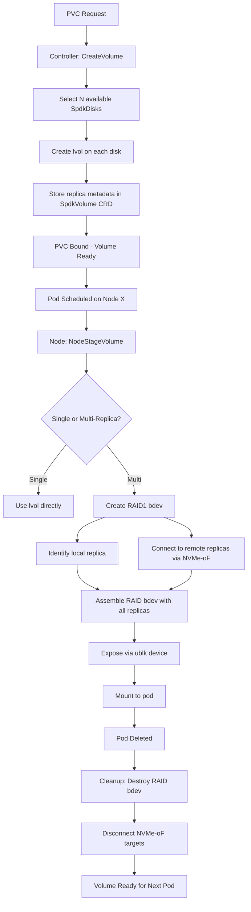

# Automatic RAID Provisioning for Flint CSI Driver

## 🎯 **Overview**

The Flint CSI driver provides **dynamic RAID1 bdev creation** during pod staging, enabling transparent multi-replica volumes with automatic cross-node redundancy. RAID bdevs are ephemeral and created on-demand when pods mount volumes.

## ✅ **Key Features**

### **1. Dynamic RAID Creation**
- **On-Demand**: RAID bdevs created during `NodeStageVolume` when pod starts
- **Ephemeral**: RAID exists only while pod is using the volume
- **Pod-Centric**: RAID assembled on the node where the pod runs

### **2. Intelligent Resource Selection**
- **Local Replica First**: Prioritizes local lvol for best performance
- **NVMe-oF for Remote**: Connects to remote replicas via NVMe-oF only when needed
- **Optimal Read Path**: Local replica used for reads when available

### **3. Thin Provisioning**
- **Efficient Storage**: Logical volumes use thin provisioning by default
- **On-Demand Allocation**: Storage allocated only when actually used
- **Faster Provisioning**: No need to clear blocks during allocation

### **4. Replica Distribution**
- **Single Replica**: Uses single lvol on one disk (no RAID needed)
- **Multi-Replica**: Creates RAID1 bdev with N members distributed across nodes

## 🔄 **Volume Lifecycle Flow**



## 📋 **Storage Class Examples**

### **Single Replica (Local Disk)**
```yaml
apiVersion: storage.k8s.io/v1
kind: StorageClass
metadata:
  name: flint-single-replica
provisioner: flint.csi.storage.io
parameters:
  replicas: "1"
  thinProvisioning: "true"
volumeBindingMode: WaitForFirstConsumer
```

### **Multi-Replica (Cross-Node Redundancy)**
```yaml
apiVersion: storage.k8s.io/v1
kind: StorageClass
metadata:
  name: flint-multi-replica
provisioner: flint.csi.storage.io
parameters:
  replicas: "3"
  thinProvisioning: "true"
volumeBindingMode: WaitForFirstConsumer
```

## 🔧 **Implementation Details**

### **Phase 1: Controller Provisioning** (CreateVolume RPC)

```rust
// src/controller.rs:351-387
async fn create_replicas(&self, disks: &[SpdkDisk], capacity: i64, volume_id: &str) {
    for disk in selected_disks {
        // Create individual lvol on each disk
        let lvol_uuid = create_volume_lvol(disk, capacity, volume_id).await?;

        // Store replica metadata (no RAID yet!)
        replicas.push(Replica {
            node: disk.spec.node_id,
            disk_ref: disk.metadata.name,
            lvol_uuid: Some(lvol_uuid),
            raid_member_index: i,
            ...
        });
    }

    // Create SpdkVolume CRD with replica list
    SpdkVolume::new(volume_id, replicas, ...);
}
```

**Result**: Volume CRD created with replica metadata, but **no RAID bdev exists yet**.

---

### **Phase 2: Node Staging** (NodeStageVolume RPC)

```rust
// src/node.rs:1244-1246
async fn node_stage_volume(&self, volume: &SpdkVolume) {
    if volume.spec.num_replicas > 1 {
        // NOW create RAID bdev dynamically
        create_raid1_bdev_for_volume(&volume).await?;
    }

    let device_path = connect_to_target_device(&volume).await?;
    // ... mount to staging path
}
```

**RAID Creation Process** (src/node.rs:77-147):

```rust
async fn create_raid1_bdev_for_volume(&self, volume: &SpdkVolume) {
    let mut base_bdevs = Vec::new();

    for replica in &volume.spec.replicas {
        if replica.node == self.driver.node_id {
            // Local replica: use lvol UUID directly
            base_bdevs.push(replica.lvol_uuid.clone());
        } else {
            // Remote replica: create NVMe-oF target on remote node
            ensure_nvmeof_target_if_needed(replica, volume).await?;

            // Connect to NVMe-oF target from this node
            let nvmf_bdev = connect_nvmeof_target(replica).await?;
            base_bdevs.push(nvmf_bdev);
        }
    }

    // Create ephemeral RAID1 bdev
    call_spdk_rpc("bdev_raid_create", {
        "name": volume.spec.volume_id,
        "raid_level": "1",
        "base_bdevs": base_bdevs.join(" "),
        "superblock": true
    }).await?;
}
```

**Result**: RAID bdev exists **only on the node where the pod is running**.

---

### **Phase 3: Pod Termination** (NodeUnstageVolume RPC)

```rust
// RAID bdev automatically cleaned up
// NVMe-oF connections disconnected
// lvols remain intact for next pod
```

---

## 🚀 **Usage Example**

### **Step 1: Deploy Application with PVC**
```yaml
apiVersion: v1
kind: PersistentVolumeClaim
metadata:
  name: my-app-storage
spec:
  accessModes:
    - ReadWriteOnce
  storageClassName: flint-multi-replica
  resources:
    requests:
      storage: 100Gi
```

### **Step 2: Volume Provisioning (Controller)**
```
1. PVC requests 100GB with 3 replicas
2. Controller selects 3 available SpdkDisks across cluster
3. Creates lvol on each disk:
   - worker-1/nvme1n1: lvol "aaaa-1111"
   - worker-2/nvme1n1: lvol "bbbb-2222"
   - worker-3/nvme1n1: lvol "cccc-3333"
4. Creates SpdkVolume CRD with replica list
5. PVC becomes Bound
```

### **Step 3: Pod Scheduling and RAID Creation (Node)**
```
1. Pod scheduled on worker-1
2. NodeStageVolume RPC triggered
3. Node service creates RAID1 bdev:
   - Local: aaaa-1111 (direct access)
   - Remote: nvmf target to worker-2 → bbbb-2222
   - Remote: nvmf target to worker-3 → cccc-3333
4. RAID bdev "pvc-xyz789" created
5. ublk exposes RAID as /dev/ublkb0
6. Filesystem mounted to pod
```

### **Step 4: Operator Visibility**
```bash
# View volumes and their replicas
kubectl get spdkvolume
NAME         REPLICAS   SIZE     STATUS    POD-NODE
pvc-xyz789   3         100Gi    healthy   worker-1

# View physical disks
kubectl get spdkdisk
NAME               NODE       CAPACITY    USED    FREE      HEALTHY
worker1-nvme1n1    worker-1   1TB        200GB   800GB     true
worker2-nvme1n1    worker-2   1TB        150GB   850GB     true
worker3-nvme1n1    worker-3   1TB        180GB   820GB     true

# View runtime RAID status in dashboard
# (RAID topology visible only while pod is running)
```

---

## ⚠️ **Error Handling & Events**

### **Provisioning Failures**
```
Event: Warning ProvisioningFailed
Message: Cannot create volume with 3 replicas (100GB):
         Only 2 healthy SpdkDisks available
```

### **Staging Failures**
```
Event: Warning StagingFailed
Message: Cannot create RAID1 bdev: Failed to connect to remote replica on worker-2
```

### **Operator Actions**
1. **Add More Disks**: Install additional NVMe devices on nodes
2. **Check Network**: Verify NVMe-oF connectivity between nodes
3. **Review Logs**: Check node agent logs for SPDK errors
4. **Manual Intervention**: Use dashboard to view disk health and volume status

---

## 🎛️ **Dashboard Integration**

The dashboard provides real-time visibility into:

- **Volume Status**: View all SpdkVolumes and their replica distribution
- **RAID Topology**: See runtime RAID bdev topology when pods are running
- **Disk Health**: Monitor SpdkDisk status, capacity, and I/O metrics
- **Performance Metrics**: Real-time IOPS and latency per RAID member
- **Replica Health**: Track individual replica health and sync status

**Note**: RAID topology is only visible when a pod is actively using the volume, as RAID bdevs are ephemeral.

---

## 🔍 **Monitoring & Troubleshooting**

### **Controller Logs** (Provisioning Phase)
```bash
kubectl logs deployment/flint-csi-controller | grep -E "\[REPLICA_CREATE\]|\[CREATE_LVOL\]"
```

### **Node Logs** (Staging Phase)
```bash
kubectl logs daemonset/flint-csi-node | grep -E "\[RAID_BDEV\]|\[NVMEOF_ONDEMAND\]"
```

### **Volume Status**
```bash
# Check volume CRD
kubectl get spdkvolume pvc-xyz789 -o yaml

# Check replica status
kubectl get spdkvolume pvc-xyz789 -o jsonpath='{.spec.replicas[*].health_status}'
```

### **Common Issues**

| Issue | Cause | Solution |
|-------|-------|----------|
| **Provisioning Fails** | Not enough healthy SpdkDisks | Add more disks or reduce replica count |
| **RAID Creation Fails** | NVMe-oF connectivity issue | Check network, firewall, NQN configuration |
| **Performance Degraded** | Remote replicas used for reads | Enable local replica optimization |
| **Volume Stuck Staging** | SPDK target not responding | Check node agent logs, restart SPDK if needed |

---

## 📈 **Benefits Summary**

### **For Users**
- ✅ **Zero Configuration**: PVC provisioning "just works"
- ✅ **Transparent Redundancy**: Multi-replica handled automatically
- ✅ **Optimal Performance**: Local replica used for reads
- ✅ **Kubernetes-Native**: Standard CSI operations

### **For Operators**
- ✅ **Simple Architecture**: No separate RAID CRD to manage
- ✅ **Resource Visibility**: SpdkVolume shows complete replica topology
- ✅ **Dashboard Monitoring**: Real-time RAID and disk metrics
- ✅ **Failure Resilience**: Automatic replica failover and rebuild

### **For Developers**
- ✅ **Pod-Centric Design**: RAID lifecycle tied to pod lifecycle
- ✅ **Stateless Nodes**: No persistent RAID state on nodes
- ✅ **Cloud-Native**: Volumes can move between nodes seamlessly
- ✅ **Debugging**: Clear separation between provisioning and staging

---

## 🏗️ **Architecture Summary**

```
Persistent State (Kubernetes):
┌──────────────────────────────────────┐
│  SpdkVolume CRD                       │
│  - volume_id                          │
│  - replicas: [                        │
│      {node: worker-1, lvol_uuid: ...},│
│      {node: worker-2, lvol_uuid: ...},│
│      {node: worker-3, lvol_uuid: ...} │
│    ]                                  │
└──────────────────────────────────────┘

Storage Layer (Per Node):
┌──────────────────────────────────────┐
│  SpdkDisk: worker1-nvme1n1            │
│  - LVS: lvs_worker1-nvme1n1           │
│  - Lvols: [                           │
│      vol_pvc-xyz789 (replica 1),      │
│      vol_pvc-abc456 (replica 2),      │
│      ...                              │
│    ]                                  │
└──────────────────────────────────────┘

Runtime (Pod Node Only):
┌──────────────────────────────────────┐
│  RAID1 bdev (ephemeral)               │
│  - name: pvc-xyz789                   │
│  - base_bdevs: [                      │
│      aaaa-1111 (local),               │
│      nvmf_1 (remote),                 │
│      nvmf_2 (remote)                  │
│    ]                                  │
│  → /dev/ublkb0 → Pod Mount            │
└──────────────────────────────────────┘
```

This design keeps persistent state in Kubernetes CRDs while creating ephemeral RAID bdevs on-demand, providing the best of both worlds: durability and flexibility.
